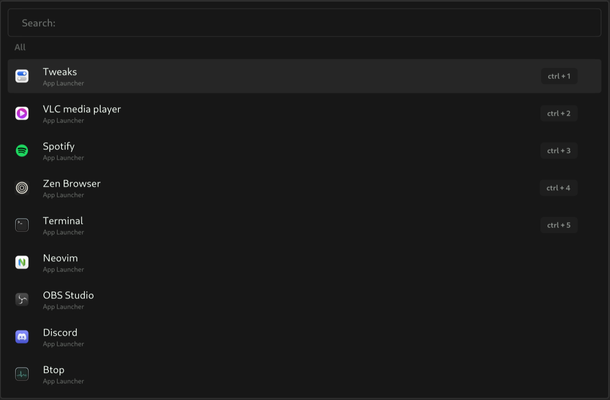

# Sherlock Application Launcher
<div align="center" style="text-align:center;">
  <picture>
    <source media="(prefers-color-scheme: dark)" srcset="images/logo-dark.svg">
    <source media="(prefers-color-scheme: light)" srcset="images/logo-light.svg">
    
  </picture>
  <picture>
    
  </picture>
</div>

<br>
<<<<<<< HEAD
Sherlock is a lightweight and efficient application launcher built with Rust and GTK4. It allows you to quickly launch your favorite applications with a user-friendly interface, providing a fast and highly-configurable way to search, launch, and track application usage..
<br><br>
=======
Sherlock is a lightweight and efficient application launcher built with Rust and GTK4. It allows you to quickly launch your favorite applications with a user-friendly interface, providing a fast and highly-configurable way to search, launch, and track application usage. <br><br>


> **🚨 Warning:** The app is was created on Arch Linux with the Hyprland tiling window manager in mind. It may cause errors or won't function at all on other system configurations.


--- 
<br><br>

## Features
### 🔧 Style Customization
- Fully customize the look and feel of the launcher.
- Modify themes and visual elements to match your preferences

### 🛠️ Custom Commands
- Define your own commands and extend the functionality of the launcher.
- Add new feartures or workflows tailored to your specifig needs.

### 🚀 Fallbacks
- Configure fallback behaviours for various commands and operations.
- Ensure a smooth experience even when certain commands fail or are unavailable.

### 🖼️ Application Aliases and Customization
- Assign aliases to your applications for better looks and quicker access.
- Assign cusom icons to your applications for a personalized touch.
- Hide apps that you don't use and don't want to clutter up your launcher.

### 🌐 Async Widget
- Use the async widget to send API requests and display their responses directly in the launcher.
- Great for integrating live data or external tools into your workflow.

### 🔍 Category-Based Search 
- Type the launcher alias and spacebar to only search within a specific category of commands.
- Categories are fully configureable, allowing you to customize search scopes.

### ⌨️ Shortcuts
- Use shortcuts like ctrl + 4 to quickly launch a command or app without having to scroll.

--- 
<br><br>

## Getting Started

### Dependencies

To run the Sherlock Launcher, ensure the following dependencies are installed:

- `gtk4` - [Gtk4 Documentation](https://docs.gtk.org/gtk4/)
- `gtk-4-layer-shell` - [Gtk4 Layer Shell](https://github.com/wmww/gtk4-layer-shell)

Additionally, if you're building from source, you will need:

- `rust` - [How to install rust](https://www.rust-lang.org/tools/install)
- `git` - [How to install git](https://github.com/git-guides/install-git)

### Installation

#### <ins>Arch Linux</ins>

If you're using Arch Linux, you can install the pre-built binary package with the following command:

```bash
yay -S sherlock-launcher-bin
```

#### <ins>From Source</ins>

To build Sherlock Launcher from source, follow these steps.<br>
Make sure you have the necessary dependencies installed:

- `rust` - [How to install rust](https://www.rust-lang.org/tools/install)
- `git` - [How to install git](https://github.com/git-guides/install-git)
- `gtk4` - [Gtk4 Documentation](https://docs.gtk.org/gtk4/)
- `gtk-4-layer-shell` - [Gtk4 Layer Shell](https://github.com/wmww/gtk4-layer-shell)

1. **Clone the repository**:

    ```bash
    git clone https://github.com/skxxtz/sherlock.git
    cd sherlock
    ```

2. **Install necessary Rust dependencies**:

    Build the project using the following command:

    ```bash
    cargo build --release
    ```

3. **Install the binary**:

    After the build completes, install the binary to your system:

    ```bash
    sudo cp target/release/sherlock /usr/bin/
    ```

---

#### <ins>Build Debian Package</ins>

To build a `.deb` package directly from the source, follow these steps:<br>
Make sure you have the folloing dependencies installed:
- `rust` - [How to install rust](https://www.rust-lang.org/tools/install)
- `git` - [How to install git](https://github.com/git-guides/install-git)
- `gtk4` - [Gtk4 Documentation](https://docs.gtk.org/gtk4/)
- `gtk-4-layer-shell` - [Gtk4 Layer Shell](https://github.com/wmww/gtk4-layer-shell)

1. **Install the `cargo-deb` tool**:

    First, you need to install the `cargo-deb` tool, which simplifies packaging Rust projects as Debian packages:

    ```bash
    cargo install cargo-deb
    ```

2. **Build the Debian package**:

    After installing `cargo-deb`, run the following command to build the `.deb` package:

    ```bash
    cargo deb
    ```

    This will create a `.deb` package in the `target/debian` directory.

3. **Install the generated `.deb` package**:

    Once the package is built, you can install it using:

    ```bash
    sudo dpkg -i target/debian/sherlock-launcher_0.1.0_amd64.deb
    ```

    (Make sure to replace the filename if the version number is different.)

After installation, you can enjoy using Sherlock Launcher, which will handle dependencies and installation automatically!

