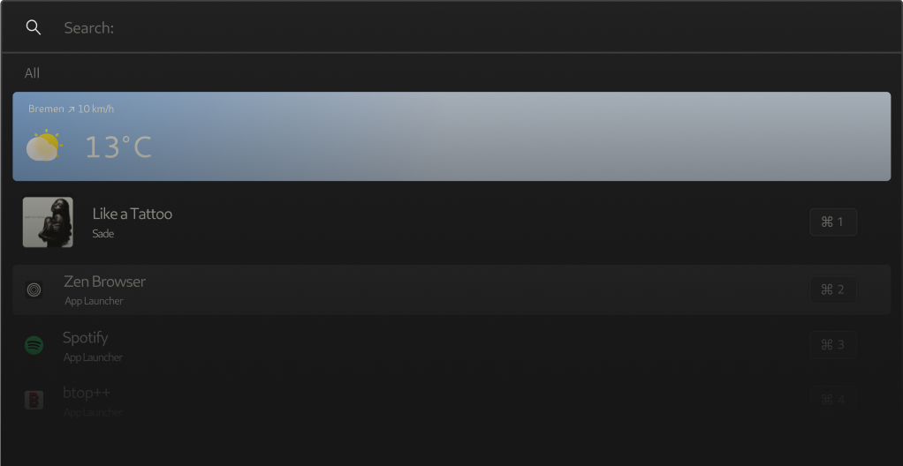

<div align="center" style="text-align:center; border-radius:10px;">
  <picture>
    <source media="(prefers-color-scheme: dark)" srcset="assets/logo-dark.svg">
    <source media="(prefers-color-scheme: light)" srcset="assets/logo-light.svg">
    
  </picture>

  [](https://discord.gg/AQ44g4Yp9q)
  <picture>
    
  </picture>
</div>


Sherlock is a lightweight and efficient application launcher built with Rust and GTK4. It allows you to quickly launch your favorite applications with a user-friendly interface, providing a fast and highly-configurable way to search, launch, and track application usage..
<br>

### Quick Links
- [Documentation](https://github.com/Skxxtz/sherlock/tree/main/docs): Sherlocks documentation
- [sherlock-wiki](https://github.com/Skxxtz/sherlock-wiki): allows you to search Wikipedia from within Sherlock using the `bulk_text` launcher.
<br><br>

> **🚨 Warning:** This app is/was created on **Arch Linux** with the **Hyprland** tiling window manager in mind. It may cause errors or won't function at all on other system configurations.
---
## Table of Contents
- [Features](#features)
- [Getting Started](#getting-started)
    - [Dependencies](#1-dependencies)
    - [Installation](#2-installation)
        - [Arch Linux](#arch-linux)
        - [From Source](#from-source)
        - [Debian](#build-debian-package)
        - [Nix](#nix)
    - [Post Installation](#3-post-installation)
        - [Config Setup](#config-setup)
        - [Keybind Setup](#keybind-setup)
---
<br><br>

## Features
### 🔧 Style Customization
- Fully customize the look and feel of the launcher.
- Modify themes and visual elements to match your preferences

### 🛠️ Custom Commands
- Define your own commands and extend the functionality of the launcher.
- Add new features or workflows tailored to your specific needs.

### 🚀 Fallbacks
- Configure fallback behaviours for various commands and operations.
- Ensure a smooth experience even when certain commands fail or are unavailable.

### 🖼️ Application Aliases and Customization
- Assign aliases to your applications for better looks and quicker access.
- Assign custom icons to your applications for a personalized touch.
- Hide apps that you don't use and don't want to clutter up your launcher.

### 🌐 Async Widget
- Use the async widget to send API requests and display their responses directly in the launcher.
- Great for integrating live data or external tools into your workflow.

### 📅 Teams Events Launcher
- Use the Teams Event Launcher to easily join upcoming Microsoft Teams meetings

### 🔍 Category-Based Search
- Type the launcher alias and spacebar to only search within a specific category of commands.
- Categories are fully configurable, allowing you to customize search scopes.

### ⌨️ Shortcuts
- Use shortcuts like ctrl + 4 to quickly launch a command or app without having to scroll.

---
<br><br>

## Getting Started

### 1. Dependencies

To run the Sherlock Launcher, ensure the following dependencies are installed:

- `gtk4` - [Gtk4 Documentation](https://docs.gtk.org/gtk4/)
- `gtk-4-layer-shell` - [Gtk4 Layer Shell](https://github.com/wmww/gtk4-layer-shell)
- `dbus` - (Used to get currently playing song)
- `openssl` - (Used for retrieving Spotify album art)
- `libssl-dev`
- `libsqlite3-dev`

Additionally, if you're building from source, you will need:

- `rust` - [How to install rust](https://www.rust-lang.org/tools/install)
- `git` - [How to install git](https://github.com/git-guides/install-git)
<br><br>
### 2. Installation

#### <ins>Arch Linux</ins>

If you're using Arch Linux, you can install the pre-built binary package with the following command:

```bash
yay -S sherlock-launcher-bin
```

#### <ins>From Source</ins>

To build Sherlock Launcher from source, follow these steps.<br>
Make sure you have the necessary dependencies installed:

- `rust` - [How to install rust](https://www.rust-lang.org/tools/install)
- `git` - [How to install git](https://github.com/git-guides/install-git)
- `gtk4` - [Gtk4 Documentation](https://docs.gtk.org/gtk4/)
- `gtk-4-layer-shell` - [Gtk4 Layer Shell](https://github.com/wmww/gtk4-layer-shell)
- `dbus` - (Used to get currently playing song)
- `openssl` - (Used for retrieving Spotify album art)
- `libssl-dev`
- `libsqlite3-dev`

1. **Clone the repository**:

    ```bash
    git clone https://github.com/skxxtz/sherlock.git
    cd sherlock
    ```

2. **Install necessary Rust dependencies**:

    Build the project using the following command:

    ```bash
    cargo build --release
    ```

3. **Install the binary**:

    After the build completes, install the binary to your system:

    ```bash
    sudo cp target/release/sherlock /usr/bin/
    ```

#### <ins>Build Debian Package</ins>

To build a `.deb` package directly from the source, follow these steps:<br>
Make sure you have the following dependencies installed:
- `rust` - [How to install rust](https://www.rust-lang.org/tools/install)
- `git` - [How to install git](https://github.com/git-guides/install-git)
- `gtk4` - [Gtk4 Documentation](https://docs.gtk.org/gtk4/)
- `gtk-4-layer-shell` - [Gtk4 Layer Shell](https://github.com/wmww/gtk4-layer-shell)

1. **Install the `cargo-deb` tool**:

    First, you need to install the `cargo-deb` tool, which simplifies packaging Rust projects as Debian packages:

    ```bash
    cargo install cargo-deb
    ```

2. **Build the Debian package**:

    After installing `cargo-deb`, run the following command to build the `.deb` package:

    ```bash
    cargo deb
    ```

    This will create a `.deb` package in the `target/debian` directory.

3. **Install the generated `.deb` package**:

    Once the package is built, you can install it using:

    ```bash
    sudo dpkg -i target/debian/sherlock-launcher_0.1.10_amd64.deb
    ```

    (Make sure to replace the filename if the version number is different.)
<br><br>

#### <ins>Nix</ins>

##### Non-Flakes Systems
Sherlock is available in `nixpkgs/unstable` as `sherlock-launcher`. If you're installing it as a standalone package you'll need to do the [config setup](#config-setup) yourself.

##### Flakes & Home-Manager
Add `sherlock.url = "github:Skxxtz/sherlock";` to the `inputs` of `flake.nix`. The sherlock flake can be installed either as a standalone package; or managed with `home-manager`, which both installs and generates configuration files.

For `home-manager` enabled systems, import the `homeManagerModules.default`/`homeModules.default` output of the flake. Then, set `programs.sherlock.enable = true;` to install and create default configuration files. home-manager will track all of the config files automatically, and they can be modified using nix syntax with `programs.sherlock.settings.<config-file>`. The config files and their associated names are:

 - `config.json` (`config.toml`): `settings.config
 - `fallback.json`: `settings.launchers`
 - `sherlock_alias.json`: `settings.aliases`

The above settings are written nix syntax the following are written as just text:

 - `main.css`: `settings.style`
 - `sherlockignore`: `settings.ignore`

You can find an example [here](https://github.com/Vanta1/dots/blob/cbefb0351df8a766b534343b4a337d0d38cdd8fe/home/programs/sherlock.nix).

To stop home-manager from symlinking these files from the nix store (this can be useful if you're iterating a lot and don't want to rebuild your system), set the file's corresponding option to `null`. `programs.sherlock.settings = null;` will stop managing all sherlock-related config files.

##### Flakes without Home-Manager
To install the standalone package, add `sherlock.packages.${pkgs.system}.default` to `environment.systemPackages`/`home.packages`. You will need to create the configuration files yourself, see below.

### 3. Post Installation

#### **Config Setup**
After the installation is completed, you can set up your configuration files. The location for them is `~/.config/sherlock/`. Depending on your needs, you should add the following files:

1. [**config.toml**](https://github.com/Skxxtz/sherlock/blob/main/docs/examples/config.toml): This file specifies the behavior and defaults of your launcher. Documentation [here](https://github.com/Skxxtz/sherlock/blob/main/docs/config.md).
2. [**fallback.json**](https://github.com/Skxxtz/sherlock/blob/main/docs/examples/fallback.json): This file specifies the features your launcher should have. Documentation [here](https://github.com/Skxxtz/sherlock/blob/main/docs/launchers.md).
3. [**sherlock_alias.json**](https://github.com/Skxxtz/sherlock/blob/main/docs/examples/sherlock_alias.json): This file specifies aliases for applications. Documentation [here](https://github.com/Skxxtz/sherlock/blob/main/docs/aliases.md).
4. [**sherlockignore**](https://github.com/Skxxtz/sherlock/blob/main/docs/examples/sherlockignore): This file specifies which applications to exclude from your search. Documentation [here](https://github.com/Skxxtz/sherlock/blob/main/docs/sherlockignore.md).
5. [**main.css**](https://github.com/Skxxtz/sherlock/blob/main/resources/main.css)

As of `version 0.1.11`, Sherlock comes with the `init` subcommand to automatically create your config. It will create versions of the files above, populated with the default values. Additionally, it will create the `icons/`, `scripts/`, and `themes/` subdirectories. All you have to do is run the following command:

```bash
sherlock init
```

#### Warnings after startup
If you're getting warnings after startup, you can press `return` to access the main application. Alternatively you can set the `try_suppress_warnings` key in the config file to true. This will prevent any warnings to be shown. The same thing can be done for errors. However, if you suppress errors, the application might not work as expected.

#### **Keybind Setup**
To launch Sherlock, you can either type `sherlock` into the command line or bind it to a key. The latter is recommended.
The setup steps vary by display manager. The setup for **Hyprland** is outlined here:

1. (Recommended) Bind the `$menu` variable to Sherlock:
```conf
$menu = sherlock
```
2. Bind a key to execute `$menu`
```conf
bind = $mainMod, space, exec, $menu
```
