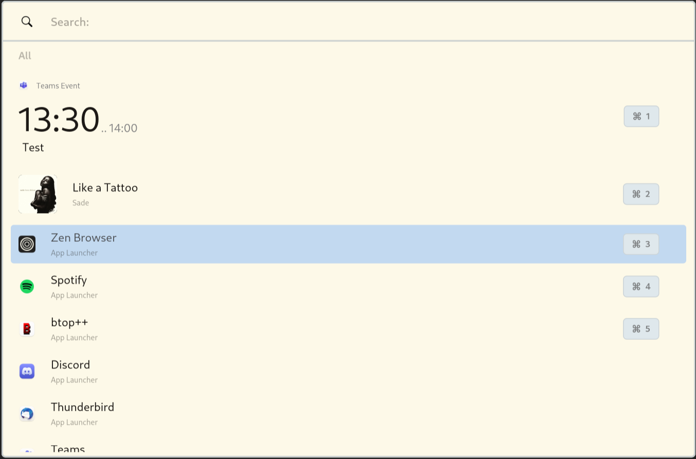

# Base Theme Extensions
For one of these themes to apply, you need to create a custom css file inside the `~/.config/sherlock/` directory. You also must have the `use_custom_css` config key set to `true`. This is enabled by default. Then you just have to reference the new stylesheet in your config as the field `config.files.css` [documentation](https://github.com/Skxxtz/sherlock/blob/main/docs/config.md#appearance-section-appearance).
 
These themes are currently based on Sherlock's `0.1.9` version
 
> 💡 You can go to the css file of the theme by clicking the image.

## Gruvbox

  <picture>
    
  </picture>

  <picture>
    
  </picture>

## Whiteout

  <picture>
    
  </picture>

